# Fundamentos-de-pruebas-de-software

**Contenido**

[Clase 1 Introducción](#Clase-1-Introducción])

[Clase 2 ¿Qué son las pruebas y por qué deberíamos hacerlas?](#Clase-2-¿Qué-son-las-pruebas-y-por-qué-deberíamos-hacerlas?])

[¿Qué son las pruebas?](¿Qué-son-las-pruebas?)

[Clase 3 Proceso de pruebas del software y los estándares internacionales](#Clase-3-Proceso-de-pruebas-del-software-y-los-estándares-internacionales)

[Etapas del desarrollo de software](#Etapas-del-desarrollo-de-software)

[Revision de las pruebas](#Revision-de-las-pruebas)

[Clase 4 Ciclo de vida del software](#Clase-4-Ciclo-de-vida-del-software)

[Clase 5 Proceso de pruebas del software: Calidad y Defectos](#Clase-5-Proceso-de-pruebas-del-software-Calidad-y-Defectos)

[Clase 6 Principios del testing moderno](#Clase-6-Principios-del-testing-moderno)

[Clase 7 Especialidades del testing](#Clase-7-Especialidades-del-testing)

[Manual tester:](#Manual-tester)

[Automation tester:](#Automation-tester)

[Security tester:](#Security-tester)

[Data science tester:](#Data-science-tester)

[SDET:](#SDET)

[DevOps:](#DevOps)

[QA Engineer:](#QA-Engineer)

[QE:](#QE)

[Habilidades dentro de las especialidades del testing](#Habilidades-dentro-de-las-especialidades-del-testing)

[Clase 8 Presupuesto, Recursos, Tiempo y Actividades Clave](#Clase-8-Presupuesto,-Recursos,-Tiempo-y-Actividades-Clave)

[Etapa de Analisis](#Etapa-de-Analisis)

[Etapa de Diseño](#Etapa-de-Diseño)

[Etapa de codigo](#Etapa-de-codigo)

[Etapa de pruebas](#Etapa-de-pruebas)

[Clase 9 Estrategia de pruebas](#Clase-9-Estrategia-de-pruebas)

[Escenarios y Contextos](#Escenarios-y-Contextos)

[Herramienta para organizar ideas](#Herramienta-para-organizar-ideas)

[¿Que problema tenemos?](#¿Que-problema-tenemos?)

[Clase 10 Testing en desarrollo de software](#Clase-10-Testing-en-desarrollo-de-software)

[¿Que es testing?](#¿Que-es-testing?)

[¿Que es cheking?](#¿Que-es-cheking?)

[Errores comunes durante la ejecución](#Errores-comunes-durante-la-ejecución)

[Clase 11 Testing ágil](#Clase-11-Testing-ágil)

## Clase 1 Introducción

En este curso veremos diferentes formas, tips y estrategias de realizar pruebas de software. Todas las técnicas te ayudarán a mejorar la calidad de tu software.

Principios del testing moderno y trabajo en equipo para implementar pruebas desde la perspectiva del tester y desarrollador

## Clase 2 ¿Qué son las pruebas y por qué deberíamos hacerlas?

¿Cuántas veces hemos sido usuarios de alguna app móvil y falla? ¿Cuántas veces hemos sido parte del desarrollo de un producto y el retrabajo se desborda por todas las fallas o defectos que contiene?.

Muchas veces la mala experiencia que tiene el usuario hace que en ese momento se deje de usar un software, app o elemento que tenga que ver directamente con experiencia como usuario 

### ¿Qué son las pruebas?

Es el proceso de evaluar un producto, aprendiendo a través de la exploración  experimentación, lo cual incluye:

Cuestionar, estudiar, modelar, observar e inferir, checar salida de datos, etc.

Verlo y entenderlo en todos sus aspectos

Realmente siempre existe un sesgo en el cual tendremos la posibilidad a si sea del 0.001% de tener un error, con la implementacion de nuevas tecnologias es muy posible que suceda esto por lo que sera necesario en algun momento recurrir a la actualizacion y optimizacion de las pruebas 

Las pruebas son una manera de explorar, experimentar, entenderlo, entre menos entiendas el productos que estas desarrollando más errores tendrá. Las puedes hacer por cuestión de costo, prestigio o cuestiones legales.

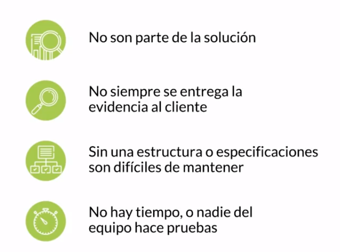

Tres aspectos a considerar:

Es necesario entender completamente aunque se tengan las mejores practicas de desarrollo o de pruebas para evitar que los defectos y errores se conviertan en re-trabajo y multiplicar los defectos o convertirlo en bola de nieve, aqui uno de los aspectos mas importantes 

- Estimar bien

- Entender el producto

- Saber quien es el cliente

- Comunicacion con el equipo de desarrollo en los diferentes niveles y subniveles para que se pueda trabajar de una manera armoniosa y adecuada. Con esto se evita recurrir en reprocesos y estar apagando incendios

## Clase 3 Proceso de pruebas del software y los estándares internacionales

### Etapas del desarrollo de software

- Que es Metodologia 

Es la parte en donde se establecen criterios o estrategias de como se va a llevar a cabo las pruebas, quien es el responsable, como se debe entregar el material, Etc.

- Recursos

Aunque se quieran hacer pruebas y no se esta preparado con el tiempo esas carencias se van a mostrar como defectos

- Herramientas

Contar con las herramientas adecuadas permiten de alguna forma acelerar el trabajo como tester en cuanto a la identificacion de problemas, documentación y comunicación

Es necesario tener muy bien definidas estas etapas para evitar re-procesos y que todo el equipo entienda la finalidad del mismo 

### Revision de las pruebas

- Definir la falta de calidad del equipo

- Detectar y corregir la falta de calidad

- Calidad del proceso

- Verificar especificaciones y necesidades del cliente

Las certificaciones pueden ser aplicadas a cualquier tipo de industria, automotriz, farmaceutica, ventas, salud, personas y empresas en general

y cada una de este tipo de industrias lleva diferentes tipos de pruebas 

No solo se deben implementar certificaciones en las empresas porque muchas veces esto no significa que cumplan con los estandares de calidad, se debe velar por cumplir y mantener estandares que promuevan el buen desarrollo de la empresa

## Clase 4 Ciclo de vida del software

A lo largo del ciclo de vida del software se realizan distintas pruebas para garantizar que este cumpla con los requerimientos para los que fue diseñado y de la misma forma se encuentren procesos de mejora y optimización a medida que se desarrolla el software.

- Es necesario hacer pruebas en todas las fases del desarrollo de software ya que un error encontrado en una etapa tardía puede generar costos muy elevados.

- Errores detectados lo antes posible reducen los costos y son mucho más fáciles de corregir.

- El ciclo de vida permite que los errores se detecten lo antes posible y por lo tanto, permite a los desarrolladores concentrarse en la calidad del software, en los plazos de implementación y en los costos asociados.

El ciclo de vida básico de un software consta de los siguientes procedimiento

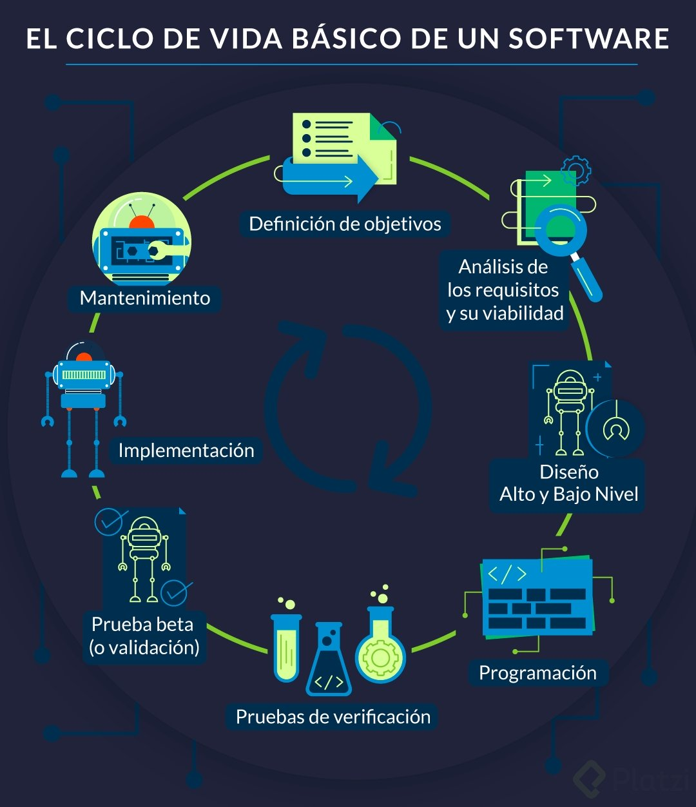

1. Definición de objetivos

    En esta fase se define el alcance general del software y su papel dentro de una estrategia global o dentro del ecosistema que va a funcionar.

2. Análisis de los requisitos y su viabilidad

    Se trata de recopilar la mayor cantidad de información posible para evaluar la viabilidad del producto, encontrar posibles restricciones y analizar todos los requisitos del cliente.

3. Diseño

    Alto nivel: Se trata de realizar un diseño básico que valide la arquitectura de la aplicación.
    Bajo nivel: Es una definición detallada de la estructura de la aplicación basada en el diseño general.

4. Programación

    Es la implementación de un lenguaje de programación para crear las funciones definidas durante la etapa de diseño.

5. Pruebas de verificación

    Aunque en todas las fases anteriores se hacen pruebas en esta fase se cubren: pruebas de componentes, integrales y de sistema.

6. Prueba beta (o validación)

    Se hace para garantizar que el software cumple con las especificaciones originales o también se hacen las pruebas de aceptación.

7. Implementación

    Se realiza una prueba del sistema implementado para encontrar posibles fallas en la Implementación.

8. Mantenimiento

    Se hace para todos los procedimientos correctivos (mantenimiento correctivo) y a las actualizaciones secundarias del software (mantenimiento continuo), junto con la actualización de las pruebas.

Si hacemos las pruebas durante cada fase del ciclo de vida del software tendremos al final del ciclo un producto validado y robusto de acuerdo a las necesidades del cliente

## Clase 5 Proceso de pruebas del software: Calidad y Defectos

La calidad es una percepción entre lo deseado, analizado y lo que vamos a entregar. La calidad la define el cliente, si esa persona esta satisfecha con lo entregado hasta ahí llega la calidad.

Los estandares de la IEEE(Insitute of Electrical and Electronics Engineers) (Instituto de Ingenieros Eléctricos y Electrónicos) asociación técnico-profesional mundial dedicada a la estandarización, entre otras cosas. Es la mayor asociación internacional, sin ánimo de lucro, formada por profesionales de las nuevas tecnologías.) forman parte de la documentacion y es la manera en la que define el cumplimiento de requisitos, necesidades o expectativas del cliente

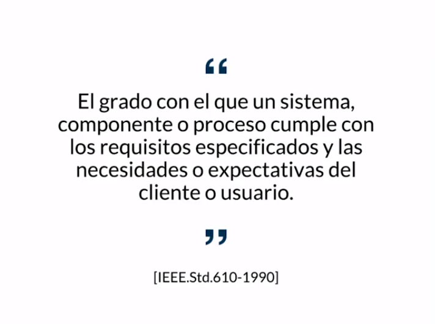

Se hace enfasis en el entendimiento y necesidades del cliente. Si los procesos de pruebas de software no son eficientes, en cada una de las fases va a empezar a haber defectos

Dentro de las etapas existe una planificacion estandar que van a variar respecto a necesidades y tiempo del proyecto

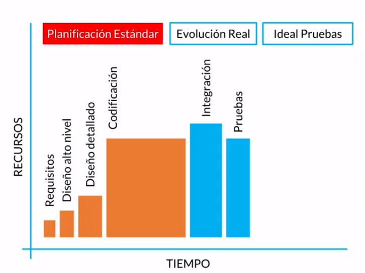

- Verificación: Es ir en cada etapa revisando que se cumpla lo propuesto por el cliente.

- Validación: Antes de entregar al cliente, validamos que efectivamente el conjunto de requerimientos esta siendo cumplido con lo entregado.

- Anomalía: Cualquier condición insatisfactoria

- Defecto: Un problema que se reproduce una y otra vez, no desempeña funciones

- Fallo: Pueden ser situaciones no asociadas al software desarrollado, incapacidad dentro de márgenes

- Error: Acción humana incorrecta

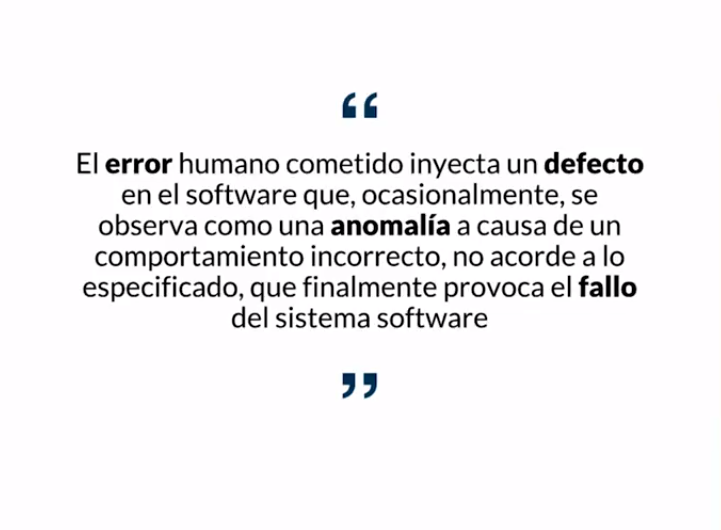

## Clase 6 Principios del testing moderno

Los principios creados por Ellen Page y Brian Jensen es acerca del testing moderno que es la evolucion natural del testing agil

El desarrollo de este principio es la necesidad de que el tester y el desarrollador evoluciones en su perspectiva para que ambos trabajen como un equipo y no como dos entidades separadas

El tester deberia enfocarse en la calidad del producto, proceso (calidad de software)

El desarrollador deberia enfocarse en desarrollar la aplicacion

El tester podria ayudar a mejorar a encontrar las mejores herramientas a entender los procesos de prueba y mejorar la calidad del desarollo 

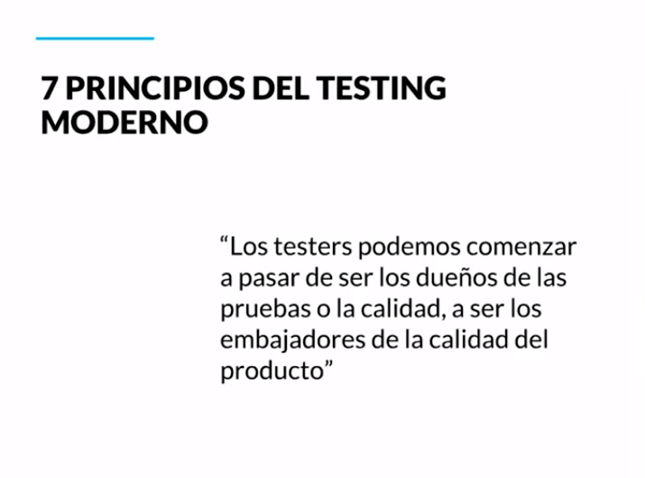

1. Nuestra prioridad es mejorar el negocio: El producto que se va a entregar al cliente permitirá hacer funcionar el negocio. Si en algún momento no quieres hacerlo, estás poniendo en riesgo ese negocio porque si el producto no se vende o no es aceptado la empresa puede cerrar o puedes perder el trabajo.

2. Nosotros aceleramos el equipo y usamos modelos como Lean Thinking y Teoría de las Restricciones para ayudar a identificar, priorizar y mitigar cuellos de botella en el sistema: Cuando queremos hacer algo, lo queremos hacer perfecto y eso puede ser demasiado. Deberías construir en base a procesos cortos para poder encontrar los defectos de una manera más rápida.

3. Nosotros somos la fuerza para la mejora continua, ayudando al equipo a adaptarse y optimizar para tener éxito, en lugar de proporcionar una red de seguridad para detectar fallas: El cliente puede entender que el producto se va a liberar por fases, es importante que nosotros enfoquemos nuestras pruebas en cada una de esas fases. No tiene que ser todo al inicio y al final, debe haber una distribución que nos permita manejar el riesgo del software

4. Nos preocupamos profundamente acerca de la cultura de calidad en nuestro equipo, y asesoramos, lideramos y nutrimos el equipo para llevarlos a una cultura de calidad más madura: Al inicio los testers eran personas desarrollando software y un día con tantos defectos y trabajo, separaron los roles para que así hubiese una persona dedicada a realizar las pruebas. El tester puede hacer recomendaciones de herramientas, mejorar el proceso o volverse un coach.

5. Nosotros creemos que el cliente es el único capaz de juzgar y evaluar la calidad de nuestro producto: Si el cliente esta satisfecho con lo entregado y cumple las expectativas entonces has alcanzado la calidad deseada.

6. Nosotros usamos datos de manera extensa y profunda para entender los casos de uso del cliente y entonces cerrar huecos entre hipótesis del producto e impacto del negocio.

7. Expandimos las habilidades de testing y el conocimiento en todo el equipo; entendemos que esto reduce o elimina la necesidad de una especialista dedicado al testing.

## Clase 7 Especialidades del testing

### Manual tester:

Nos ayuda a definir los casos de pruebas, establecer estrategias. También ejecuta, pero lleva lo necesario para que todos sepan qué hacer.

Pensamiento lateral, piensa fuera de la caja con una nueva perspectiva, agrega nuevos casos de usos y entiende muy bien al usuario.

### Automation tester: 

Se encarga de agilizar, acelerar el trabajo y actividades que nos quitan la oportunidad de encontrar más casos de usos.

Conoce de programación, no solo de forma básica, debe conocer como crear diseños de frameworks y soluciones. El código crece y las pruebas también, darle ese mantenimiento a las pruebas es un problema común.

### Security tester: 

Encargado para el área de seguridad. Debe ser alguien que aporte valor desde la perspectiva de la seguridad.

Protocolos, estándares, legalizaciones dependiendo de cada país y marca. Esta enfocado en prever ataques, virus, problemas de seguridad, acceso no autorizado. Profundizar en las técnicas y prácticas de seguridad.

### Data science tester: 

Con la manera en que crecen los datos en un proyecto, se necesita a alguien que los analice, agrupe y limpie estos datos.

Análisis y Limpieza de datos, omite tener un set de pruebas amplio donde la variedad va a permitir detectar defectos inesperados. Esto puede ser clave para que los resultados no sean falsos positivos

### SDET: 

Es la combinacion de un desarrollador que ya sabe hacer pruebas. Con la diferencia de automatiza y hace uso de herramientas que organizan la operación de la entrega de las pruebas. Esta persona se asegura de que las pruebas se ejecuten antes de liberar el código.

El programador ahora sabe hacer pruebas y conoce de herramientas que le permite entregarlas de una manera automatizada.

### DevOps: 

Conoce todo lo anterior y domina el conocimiento de automatizar el proceso, se asegura de una entrega continua.

Una automatización de la operación, Entrega Continua. Donde se entregan de forma más rápida las nuevas versiones.

### QA Engineer: 

Quality Assurance. Esta enfocado en el producto y en el proceso.

Procesos de Calidad

### QE: 

Quality Engineer. Es como un coach, acompaña en las politicas de calidad en la empresa o equipo.

Soluciones de estrategias de calidad.

### Habilidades dentro de las especialidades del testing 

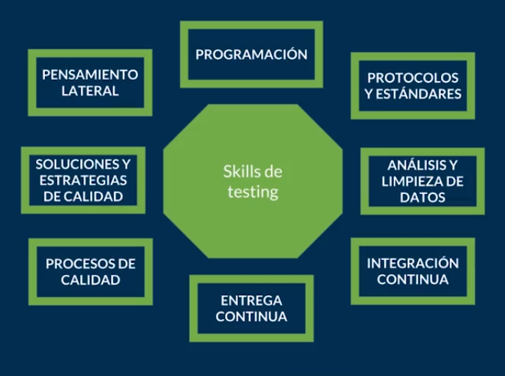

## Clase 8 Presupuesto, Recursos, Tiempo y Actividades Clave

Elementos para crear un proyecto de software tienen que ver con el presupuesto, recursos y tiempos

Si un proyecto no tiene suficiente dinero para tener el equipo necesario de personas e infraestructura no se va a poder llevar a cabo

Si no se cuenta con el equipo de recurso humano ideal e idoneo con el conocimiento el proyecto peude que no se lleve a cabo o por lo menos puede pasar que no se cumpla el tiempo estimado del mismo

Los costos tambien pueden llegar a incrementar

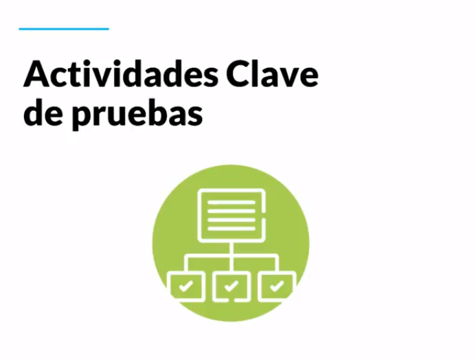

## Etapa de Analisis

- Revision con el cliente y equipo

- Documentacion

- Pruebas de requerimientos del cliente

- Alcance y necesidad del cliente y como puedo empezar a abordar los problemas que se puedan llegar a aparecer por mas ambiguos que sean y tambien como voy a confirmar que un requerimiento se cumpla

## Etapa de Diseño

- Criterios visuales que espera el cliente

- Que espera en la funcionalidad combinado con el diseño del producto

- Alertas del producto al hacer check de manera correcta o incorrecta

## Etapa de codigo

- Revision e implementacion de modulos, funciones o bases de datos

- Verificacion de lo que esta en el backend y en lo posible si existe el Frontend

- Revision de las mejores practicas para la implementacion y desarrollo del software

## Etapa de pruebas

- Pruebas de transmision de datos en distintos dispositivos

- Confirmacion de los requerimientos del cliente a traves de la validacion y verificacion

- Pruebas de aceptacion donde el usuario final acepta el producto requerido pero se debe tener que cuenta que antes de entregar al cliente final se tuvieron que haber hecho todas las pruebas posibles en las anteriores etapas

## Clase 9 Estrategia de pruebas

Son aquellas que nos permiten saber por donde comenzar 

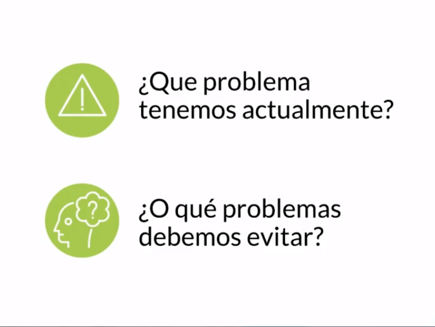

### Escenarios y Contextos

- Seguridad

- Arquitectura

- Performance

- Usabilidad

- Escalabilidad

### Herramienta para organizar ideas

https://mindmup.com 

### ¿Que problema tenemos?

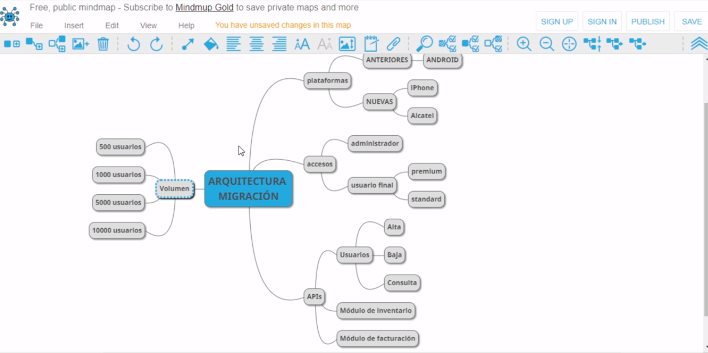

## Clase 10 Testing en desarrollo de software

### ¿Que es testing?

Es la exploración de una idea, aprender a conocer como sucede un flujo, como se generan datos, como se llena un formulario y genere nuevos resultados

### ¿Que es cheking?

Es cuando se sabe que ya sucede algo y se verifica que sigue pasando

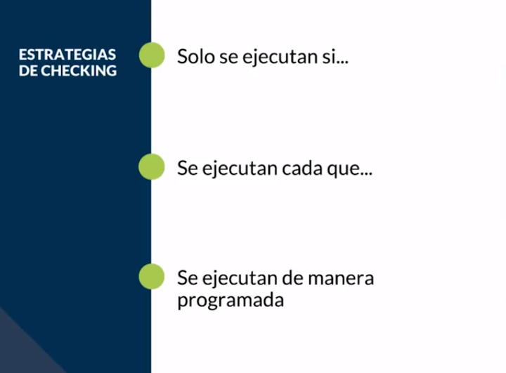

- Solo se ejecutan si ... sucede algo

- Se ejecutan cada que ... libere

- Se ejecutan de manera programada 

### Errores comunes durante la ejecución

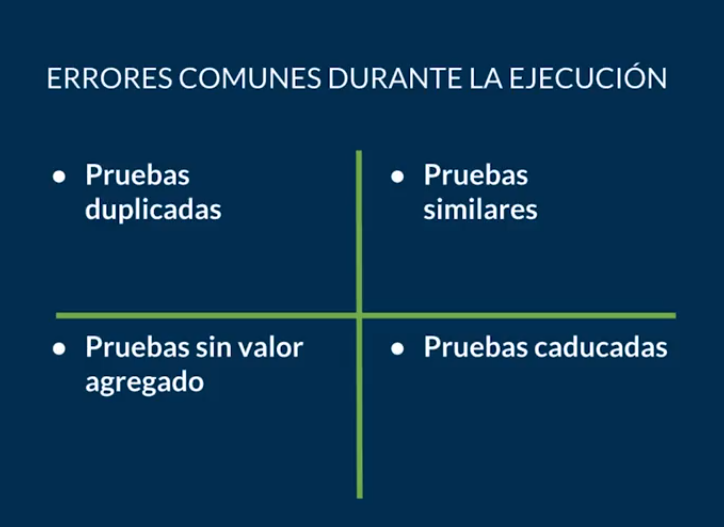

- Pruebas duplicadas: Al no tener una buena organización o comunicación con el equipo, la cobertura de pruebas puede ser duplicada, por ejemplo que algún otro miembro ya probó

- Pruebas similares: A veces se pueden crear pruebas que tienen que ver con el mismo flujo.

- Pruebas sin valor agregado: Aquellas que no están asociadas al negocio, se debe priorizar siempre.

- Pruebas caducadas: Se refiere a la tecnología por ejemplo que se esté usando ya que como sabemos se suelen ir actualizando.

Cuando logramos distinguir correctamente entre pruebas y verificación es cuando entra la automatización de pruebas, con ella se usa un software especial para controlar y comparar los resultados obtenidos de los esperados, es entonces una verificación repetitiva y automatizada.

La automatización de pruebas consiste en el uso de software especial para controlar la ejecución de pruebas y la comparación entre los resultados obtenidos y los resultados esperados. 

Sin embaro, se trata de un checking repetitivo y automatizado.

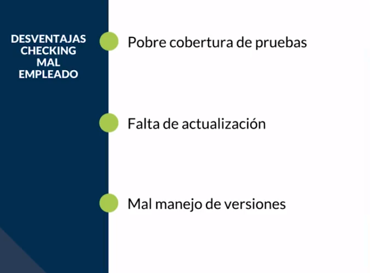

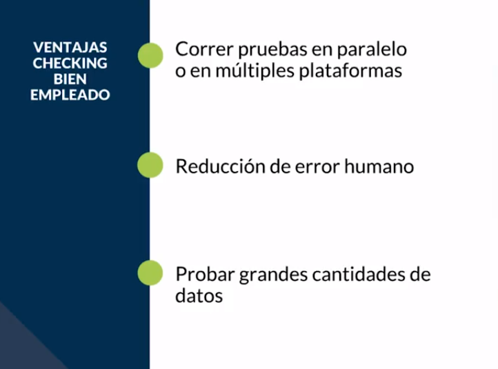

## Clase 11 Testing ágil

