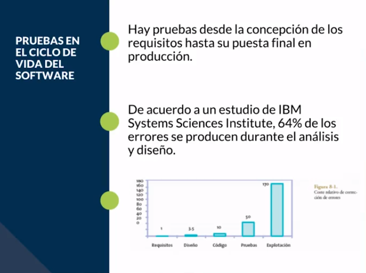
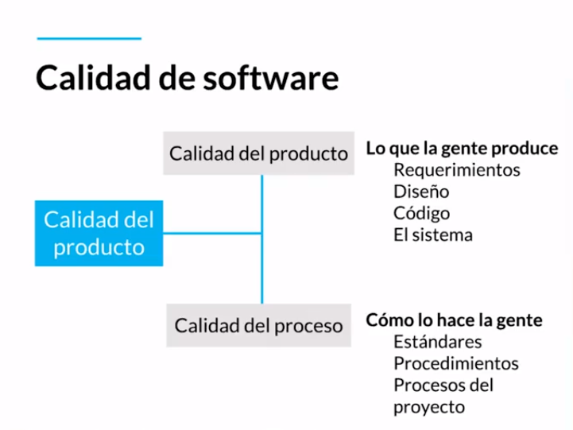
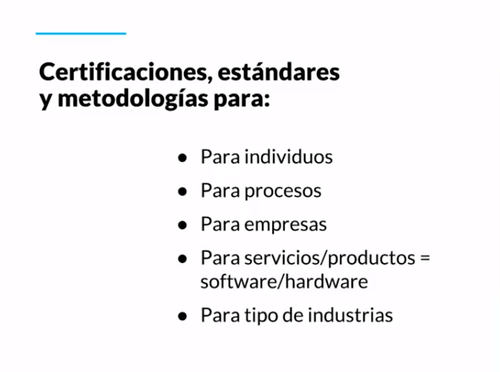
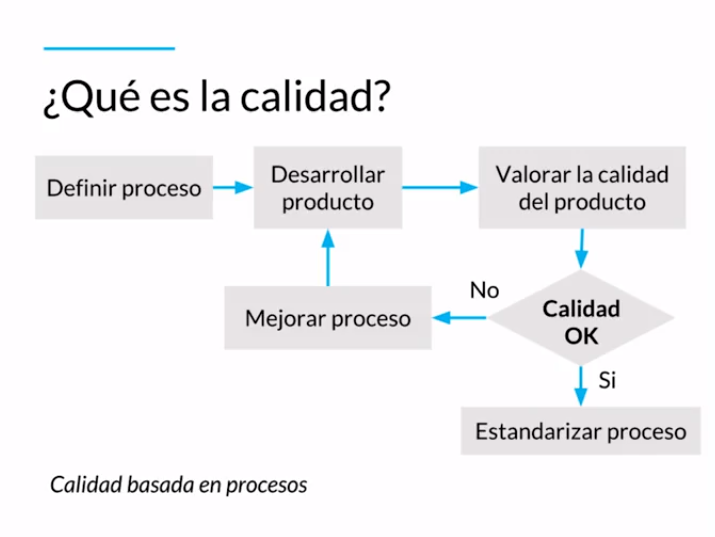
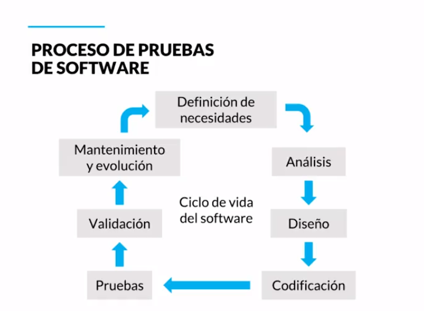

# Fundamentos-de-pruebas-de-software
<<<<<<< HEAD

**Contenido**

[Clase 1 Introducción](#Clase-1-Introducción])

[Clase 2 ¿Qué son las pruebas y por qué deberíamos hacerlas?](#Clase-2-¿Qué-son-las-pruebas-y-por-qué-deberíamos-hacerlas?])

[¿Qué son las pruebas?](¿Qué-son-las-pruebas?)

[Clase 3 Proceso de pruebas del software y los estándares internacionales](#Clase-3-Proceso-de-pruebas-del-software-y-los-estándares-internacionales)

[Etapas del desarrollo de software](#Etapas-del-desarrollo-de-software)

[Revision de las pruebas](#Revision-de-las-pruebas)

[Clase 4 Ciclo de vida del software](#Clase-4-Ciclo-de-vida-del-software)

[Clase 5 Proceso de pruebas del software: Calidad y Defectos](#Clase-5-Proceso-de-pruebas-del-software:-Calidad-y-Defectos)

## Clase 1 Introducción

En este curso veremos diferentes formas, tips y estrategias de realizar pruebas de software. Todas las técnicas te ayudarán a mejorar la calidad de tu software.

Principios del testing moderno y trabajo en equipo para implementar pruebas desde la perspectiva del tester y desarrollador

## Clase 2 ¿Qué son las pruebas y por qué deberíamos hacerlas?

¿Cuántas veces hemos sido usuarios de alguna app móvil y falla? ¿Cuántas veces hemos sido parte del desarrollo de un producto y el retrabajo se desborda por todas las fallas o defectos que contiene?.

Muchas veces la mala experiencia que tiene el usuario hace que en ese momento se deje de usar un software, app o elemento que tenga que ver directamente con experiencia como usuario 

### ¿Qué son las pruebas?

Es el proceso de evaluar un producto, aprendiendo a través de la exploración  experimentación, lo cual incluye:

Cuestionar, estudiar, modelar, observar e inferir, checar salida de datos, etc.

Verlo y entenderlo en todos sus aspectos

Realmente siempre existe un sesgo en el cual tendremos la posibilidad a si sea del 0.001% de tener un error, con la implementacion de nuevas tecnologias es muy posible que suceda esto por lo que sera necesario en algun momento recurrir a la actualizacion y optimizacion de las pruebas 

Las pruebas son una manera de explorar, experimentar, entenderlo, entre menos entiendas el productos que estas desarrollando más errores tendrá. Las puedes hacer por cuestión de costo, prestigio o cuestiones legales.

Tres aspectos a considerar:

Es necesario entender completamente aunque se tengan las mejores practicas de desarrollo o de pruebas para evitar que los defectos y errores se conviertan en re-trabajo y multiplicar los defectos o convertirlo en bola de nieve, aqui uno de los aspectos mas importantes 

- Estimar bien

- Entender el producto

- Saber quien es el cliente

- Comunicacion con el equipo de desarrollo en los diferentes niveles y subniveles para que se pueda trabajar de una manera armoniosa y adecuada. Con esto se evita recurrir en reprocesos y estar apagando incendios

## Clase 3 Proceso de pruebas del software y los estándares internacionales

### Etapas del desarrollo de software

- Que es Metodologia 

Es la parte en donde se establecen criterios o estrategias de como se va a llevar a cabo las pruebas, quien es el responsable, como se debe entregar el material, Etc.

- Recursos

Aunque se quieran hacer pruebas y no se esta preparado con el tiempo esas carencias se van a mostrar como defectos

- Herramientas

Contar con las herramientas adecuadas permiten de alguna forma acelerar el trabajo como tester en cuanto a la identificacion de problemas, documentación y comunicación

Es necesario tener muy bien definidas estas etapas para evitar re-procesos y que todo el equipo entienda la finalidad del mismo 

### Revision de las pruebas

- Definir la falta de calidad del equipo

- Detectar y corregir la falta de calidad

- Calidad del proceso

- Verificar especificaciones y necesidades del cliente

Las certificaciones pueden ser aplicadas a cualquier tipo de industria, automotriz, farmaceutica, ventas, salud, personas y empresas en general

y cada una de este tipo de industrias lleva diferentes tipos de pruebas 

No solo se deben implementar certificaciones en las empresas porque muchas veces esto no significa que cumplan con los estandares de calidad, se debe velar por cumplir y mantener estandares que promuevan el buen desarrollo de la empresa

## Clase 4 Ciclo de vida del software

A lo largo del ciclo de vida del software se realizan distintas pruebas para garantizar que este cumpla con los requerimientos para los que fue diseñado y de la misma forma se encuentren procesos de mejora y optimización a medida que se desarrolla el software.

- Es necesario hacer pruebas en todas las fases del desarrollo de software ya que un error encontrado en una etapa tardía puede generar costos muy elevados.

- Errores detectados lo antes posible reducen los costos y son mucho más fáciles de corregir.

- El ciclo de vida permite que los errores se detecten lo antes posible y por lo tanto, permite a los desarrolladores concentrarse en la calidad del software, en los plazos de implementación y en los costos asociados.

El ciclo de vida básico de un software consta de los siguientes procedimiento

1. Definición de objetivos

    En esta fase se define el alcance general del software y su papel dentro de una estrategia global o dentro del ecosistema que va a funcionar.

2. Análisis de los requisitos y su viabilidad

    Se trata de recopilar la mayor cantidad de información posible para evaluar la viabilidad del producto, encontrar posibles restricciones y analizar todos los requisitos del cliente.

3. Diseño

    Alto nivel: Se trata de realizar un diseño básico que valide la arquitectura de la aplicación.
    Bajo nivel: Es una definición detallada de la estructura de la aplicación basada en el diseño general.

4. Programación

    Es la implementación de un lenguaje de programación para crear las funciones definidas durante la etapa de diseño.

5. Pruebas de verificación

    Aunque en todas las fases anteriores se hacen pruebas en esta fase se cubren: pruebas de componentes, integrales y de sistema.

6. Prueba beta (o validación)

    Se hace para garantizar que el software cumple con las especificaciones originales o también se hacen las pruebas de aceptación.

7. Implementación

    Se realiza una prueba del sistema implementado para encontrar posibles fallas en la Implementación.

8. Mantenimiento

    Se hace para todos los procedimientos correctivos (mantenimiento correctivo) y a las actualizaciones secundarias del software (mantenimiento continuo), junto con la actualización de las pruebas.

Si hacemos las pruebas durante cada fase del ciclo de vida del software tendremos al final del ciclo un producto validado y robusto de acuerdo a las necesidades del cliente

## Clase 5 Proceso de pruebas del software: Calidad y Defectos

La calidad es una percepción entre lo deseado, analizado y lo que vamos a entregar. La calidad la define el cliente, si esa persona esta satisfecha con lo entregado hasta ahí llega la calidad.

Los estandares de la IEEE(Insitute of Electrical and Electronics Engineers) (Instituto de Ingenieros Eléctricos y Electrónicos) asociación técnico-profesional mundial dedicada a la estandarización, entre otras cosas. Es la mayor asociación internacional, sin ánimo de lucro, formada por profesionales de las nuevas tecnologías.) forman parte de la documentacion y es la manera en la que define el cumplimiento de requisitos, necesidades o expectativas del cliente

Se hace enfasis en el entendimiento y necesidades del cliente. Si los procesos de pruebas de software no son eficientes, en cada una de las fases va a empezar a haber defectos

Dentro de las etapas existe una planificacion estandar que van a variar respecto a necesidades y tiempo del proyecto

- Verificación: Es ir en cada etapa revisando que se cumpla lo propuesto por el cliente.

- Validación: Antes de entregar al cliente, validamos que efectivamente el conjunto de requerimientos esta siendo cumplido con lo entregado.

- Anomalía: Cualquier condición insatisfactoria

- Defecto: Un problema que se reproduce una y otra vez, no desempeña funciones

- Fallo: Pueden ser situaciones no asociadas al software desarrollado, incapacidad dentro de márgenes

- Error: Acción humana incorrecta

=======
Curso de Fundamentos de pruebas de software realizado en Platzi
>>>>>>> f528b194fdd7460bdf41bd517dd4a4466f4c7ce5
